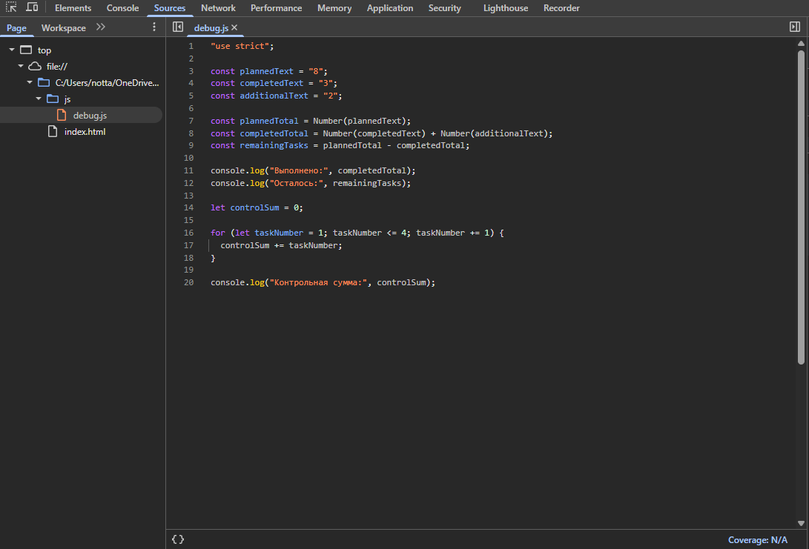

# Практическая работа №1

Воробьев Никита Сергеевич, группа ЭФБО-04-25.
Номер в журнале 7, значит вариант 7: `((7 - 1) % 8) + 1 = 7`.

Данные варианта: `totalTasks = 10`, `completedTasks = 7`, `dailyLimit = 3`.

## Окружение

Работал на Windows. Node.js, npm, Git, браузер Chrome.

Проверка версий:

```text
> node --version
вставить результат

> npm.cmd --version
вставить результат

> git --version
вставить результат
```

Обычный `npm --version` в PowerShell не сработал из-за ограничения на выполнение `npm.ps1`, поэтому использовал `npm.cmd`.

## Как запускать

Из корня репозитория:

```bash
node practice-01/js/hello.js
node practice-01/js/types.js
node practice-01/js/progress.js
node practice-01/js/plan.js
node practice-01/js/debug.js
```

В браузере открываю `practice-01/index.html`, в теге `script` меняю путь на нужный файл, сохраняю, обновляю страницу и смотрю вкладку Console (F12).

## Задание 1

Запускал `hello.js` двумя способами. Через `node practice-01/js/hello.js` вывод появился в терминале. Через браузер — во вкладке Console, на самой странице текста нет, потому что `console.log` выводит данные в консоль, а не в HTML.

Первые строки вывода в двух средах совпадают, отличается результат проверки `typeof document`. В Node.js `typeof document` даёт `undefined`, а в браузере — `object`.

Получается, `document` создаётся браузером как часть окружения веб-страницы. В Node.js страницы и DOM нет, поэтому объекта `document` там нет.

## Задание 2

|  № | Выражение          | Ожидание до запуска | Результат  | Тип     | Объяснение                                                                                              |
| -: | ------------------ | ------------------- | ---------- | ------- | ------------------------------------------------------------------------------------------------------- |
|  1 | `"8" + 2`          | 82                  | 82         | string  | Плюс со строкой выполняет объединение, поэтому `2` превращается в `"2"`.                                |
|  2 | `"8" - 2`          | 6                   | 6          | number  | Оператор `-` работает с числами, поэтому строка `"8"` преобразуется в число.                            |
|  3 | `Number("8") + 2`  | 10                  | 10         | number  | Сначала строка явно преобразуется в число, после чего выполняется сложение.                             |
|  4 | `"12" > "3"`       | false               | false      | boolean | Обе величины являются строками и сравниваются посимвольно. `"1"` меньше `"3"`.                          |
|  5 | `12 === "12"`      | false               | false      | boolean | Строгое сравнение учитывает и значение, и тип. Здесь `number` и `string`.                               |
|  6 | `Number("")`       | 0                   | 0          | number  | При числовом преобразовании пустая строка превращается в `0`.                                           |
|  7 | `Number("text")`   | NaN                 | NaN        | number  | Строку `"text"` невозможно преобразовать в число, поэтому получается `NaN`. Его тип всё равно `number`. |
|  8 | `Boolean("false")` | true                | true       | boolean | Любая непустая строка является `true`, независимо от её содержимого.                                    |
|  9 | `typeof null`      | object              | `"object"` | string  | Это особенность JavaScript: `typeof null` возвращает строку `"object"`.                                 |
| 10 | `typeof NaN`       | number              | `"number"` | string  | `NaN` является специальным числовым значением, а результат `typeof` сам имеет тип `string`.             |

## Задание 3

Сначала проверяю типы значений, затем целые ли это числа и находятся ли они в допустимых границах. После этого отдельно проверяю случай, когда задач нет вообще, и только потом вычисляю процент.

| Проверка                   | Данные   | Ожидается                       | Фактически                                    | Итог     |
| -------------------------- | -------- | ------------------------------- | --------------------------------------------- | -------- |
| Свой вариант               | 10, 7    | осталось 3, 70.0%, «В работе»   | осталось 3, 70.0%, «В работе»                 | Пройдено |
| Обычный случай             | 12, 5    | осталось 7, 41.7%, «В работе»   | осталось 7, 41.7%, «В работе»                 | Пройдено |
| Задач нет                  | 0, 0     | «Задач пока нет»                | «Задач пока нет»                              | Пройдено |
| Ничего не сделано          | 5, 0     | осталось 5, 0.0%, «Не начато»   | осталось 5, 0.0%, «Не начато»                 | Пройдено |
| Всё сделано                | 5, 5     | осталось 0, 100.0%, «Завершено» | осталось 0, 100.0%, «Завершено»               | Пройдено |
| Выполнено больше, чем есть | 5, 6     | ошибка                          | `Ошибка: выполнено больше, чем существует.`   | Пройдено |
| Отрицательное число        | -1, 0    | ошибка                          | `Ошибка: отрицательное количество.`           | Пройдено |
| Дробное число              | 5, 2.5   | ошибка                          | `Ошибка: количество задач должно быть целым.` | Пройдено |
| Строка вместо числа        | `"5"`, 2 | ошибка                          | `Ошибка: вместо числа передана строка.`       | Пройдено |
| Больше 1000                | 1001, 0  | ошибка                          | `Ошибка: превышена верхняя граница.`          | Пройдено |
| NaN                        | NaN, 0   | ошибка                          | `Ошибка: недопустимое числовое значение.`     | Пройдено |

## Задание 4

Проверки те же, что и в задании 3, плюс проверка дневной нормы. Она должна быть целым числом от 1 до 1000. Для каждого дня используется `Math.min()`, поэтому в последний день нельзя выполнить больше задач, чем осталось.

| Проверка                   | Данные      | Ожидается                   | Фактически                                        | Итог     |
| -------------------------- | ----------- | --------------------------- | ------------------------------------------------- | -------- |
| Свой вариант               | 10, 7, 3    | 1 день, выполнено 3 задачи  | осталось 3, день 1: 3 задачи, дней 1              | Пройдено |
| Обычный случай             | 12, 5, 3    | 3 дня, в последний 1 задача | осталось 7, дни 3 / 3 / 1, дней 3                 | Пройдено |
| Делится ровно              | 10, 4, 3    | 2 дня по 3 задачи           | осталось 6, дни 3 / 3, дней 2                     | Пройдено |
| Норма больше остатка       | 5, 3, 10    | 1 день, выполнено 2 задачи  | осталось 2, день 1: 2 задачи, дней 1              | Пройдено |
| Всё сделано                | 5, 5, 2     | 0 дней                      | Все задачи уже выполнены, дней 0                  | Пройдено |
| Задач нет                  | 0, 0, 2     | 0 дней                      | Все задачи уже выполнены, дней 0                  | Пройдено |
| Норма 0                    | 5, 2, 0     | ошибка                      | `Ошибка: дневная норма должна быть не меньше 1.`  | Пройдено |
| Дробная норма              | 5, 2, 1.5   | ошибка                      | `Ошибка: дневная норма должна быть целым числом.` | Пройдено |
| Выполнено больше, чем есть | 5, 6, 2     | ошибка                      | `Ошибка: некорректное число выполненных задач.`   | Пройдено |
| Норма строкой              | 5, 2, `"2"` | ошибка                      | `Ошибка: дневная норма задана строкой.`           | Пройдено |
| Норма больше 1000          | 5, 2, 1001  | ошибка                      | `Ошибка: превышена верхняя граница нормы.`        | Пройдено |

## Задание 5

Исходная программа отработала без исключения, но результат был неправильным:

```text
Выполнено: 32
Осталось: -24
Контрольная сумма: 6
```

После исправления:

```text
Выполнено: 5
Осталось: 3
Контрольная сумма: 10
```

| Ошибка                    | Что было видно                | Причина                                                                                   | Как исправил                           | Результат               |
| ------------------------- | ----------------------------- | ----------------------------------------------------------------------------------------- | -------------------------------------- | ----------------------- |
| Подсчёт выполненных задач | Выполнено 32, осталось -24    | `completedText` и `additionalText` были строками, поэтому оператор `+` склеил их в `"32"` | Использовал `Number()` перед сложением | Выполнено 5, осталось 3 |
| Граница цикла             | Контрольная сумма 6 вместо 10 | Условие `taskNumber < 4` не включало число 4                                              | Заменил условие на `taskNumber <= 4`   | Контрольная сумма 10    |



## Вывод

В ходе этой практической работы разобрался с базовыми типами JavaScript, преобразованием строк, чисел и логических значений, а также с разницей между выполнением программы в Node.js и браузере.

На заданиях 3 и 4 научился проверять входные данные до выполнения расчётов, учитывать граничные случаи и использовать цикл `while` для пошагового построения плана.